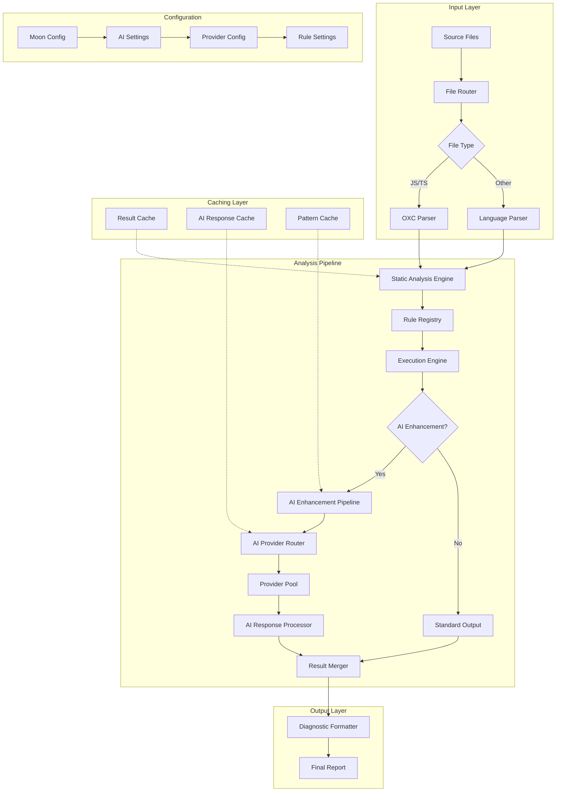
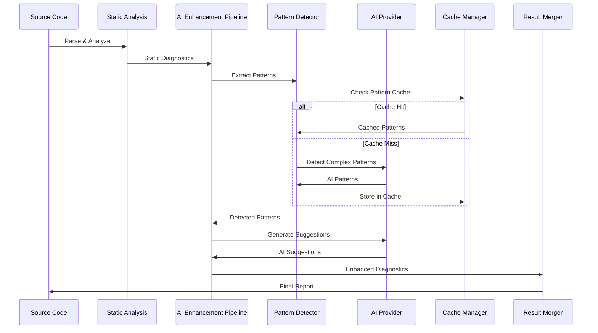

# AI-Supported Linter Architecture for Moon Shine

## Executive Summary

This document presents a comprehensive architecture for integrating AI capabilities into the Moon Shine linter system. The design builds upon the existing OXC adapter, workflow engine, provider router, and rulebase system to create a hybrid AI-enhanced linting platform that combines the speed of static analysis with the intelligence of AI pattern detection.

## Table of Contents

1. [Architecture Overview](#architecture-overview)
2. [Core Components](#core-components)
3. [AI Enhancement Pipeline](#ai-enhancement-pipeline)
4. [Integration Points](#integration-points)
5. [Performance Optimization](#performance-optimization)
6. [Configuration System](#configuration-system)
7. [Implementation Roadmap](#implementation-roadmap)
8. [Technical Specifications](#technical-specifications)

## Architecture Overview

### High-Level System Design



### Core Principles

1. **Hybrid Analysis**: Combine fast static analysis with intelligent AI pattern detection
2. **Provider Agnostic**: Support multiple AI providers with intelligent routing
3. **Performance First**: Minimize latency through aggressive caching and parallel processing
4. **Configuration Driven**: Flexible configuration system for different use cases
5. **Incremental Enhancement**: Gradually upgrade existing rules with AI capabilities

## Core Components

### 1. AI Enhancement Pipeline

The AI Enhancement Pipeline sits between the static analysis engine and the output formatter, providing intelligent pattern detection and contextual suggestions.

#### Component Structure
```rust
// Location: src/ai_enhancement/mod.rs
pub struct AIEnhancementPipeline {
    pattern_detector: PatternDetector,
    context_analyzer: ContextAnalyzer,
    suggestion_generator: SuggestionGenerator,
    cache_manager: CacheManager,
    config: AIEnhancementConfig,
}

pub struct AIEnhancementResult {
    pub enhanced_diagnostics: Vec<EnhancedDiagnostic>,
    pub ai_suggestions: Vec<AISuggestion>,
    pub confidence_scores: HashMap<String, f32>,
    pub performance_metrics: PerformanceMetrics,
}

#[derive(Debug, Clone)]
pub struct EnhancedDiagnostic {
    pub original_diagnostic: LintDiagnostic,
    pub ai_context: Option<AIContext>,
    pub suggested_fixes: Vec<AIFix>,
    pub confidence: f32,
    pub reasoning: String,
}
```

#### Pattern Detection Engine
```rust
// Location: src/ai_enhancement/pattern_detector.rs
pub struct PatternDetector {
    neural_models: NeuralModelPool,
    rule_patterns: RulePatternRegistry,
    behavioral_analyzer: BehavioralAnalyzer,
}

impl PatternDetector {
    pub async fn detect_patterns(
        &self,
        source_code: &str,
        static_diagnostics: &[LintDiagnostic],
        context: &AnalysisContext,
    ) -> Result<Vec<DetectedPattern>, AIError> {
        // 1. Extract semantic patterns from AST
        let semantic_patterns = self.extract_semantic_patterns(source_code)?;

        // 2. Analyze behavioral patterns
        let behavioral_patterns = self.behavioral_analyzer
            .analyze(source_code, context).await?;

        // 3. Apply neural pattern recognition
        let neural_patterns = self.neural_models
            .detect_patterns(source_code, &semantic_patterns).await?;

        // 4. Merge and rank patterns
        Ok(self.merge_patterns(semantic_patterns, behavioral_patterns, neural_patterns))
    }
}
```

### 2. AI Provider Interface

A unified interface for interacting with different AI providers, building on the existing provider router.

#### Enhanced Provider Interface
```rust
// Location: src/ai_enhancement/provider_interface.rs
#[async_trait]
pub trait AILinterProvider: Send + Sync {
    async fn analyze_code(
        &self,
        request: CodeAnalysisRequest,
    ) -> Result<CodeAnalysisResponse, AIError>;

    async fn suggest_fixes(
        &self,
        request: FixSuggestionRequest,
    ) -> Result<FixSuggestionResponse, AIError>;

    async fn detect_patterns(
        &self,
        request: PatternDetectionRequest,
    ) -> Result<PatternDetectionResponse, AIError>;

    fn capabilities(&self) -> ProviderCapabilities;
    fn cost_estimate(&self, request_size: usize) -> f32;
}

pub struct UnifiedAIProvider {
    claude_provider: ClaudeProvider,
    gemini_provider: GeminiProvider,
    codex_provider: CodexProvider,
    router: EnhancedAIRouter,
}

impl UnifiedAIProvider {
    pub async fn execute_smart_analysis(
        &self,
        request: SmartAnalysisRequest,
    ) -> Result<SmartAnalysisResponse, AIError> {
        // 1. Route to optimal provider based on request type
        let provider = self.router.select_optimal_provider(&request)?;

        // 2. Execute with fallback chain
        match provider.analyze_code(request.into()).await {
            Ok(response) => Ok(response.into()),
            Err(_) => self.execute_with_fallback(request).await,
        }
    }
}
```

### 3. Caching and Performance System

Intelligent caching system to minimize AI API calls and improve response times.

#### Multi-Level Caching Architecture
```rust
// Location: src/ai_enhancement/caching.rs
pub struct AICache {
    response_cache: ResponseCache,
    pattern_cache: PatternCache,
    embedding_cache: EmbeddingCache,
    config: CacheConfig,
}

pub struct ResponseCache {
    disk_cache: DiskCache<String, CachedAIResponse>,
    memory_cache: LruCache<String, CachedAIResponse>,
    ttl_manager: TTLManager,
}

impl AICache {
    pub async fn get_or_compute<F, Fut>(
        &self,
        key: &str,
        compute_fn: F,
    ) -> Result<CachedAIResponse, AIError>
    where
        F: FnOnce() -> Fut,
        Fut: Future<Output = Result<AIResponse, AIError>>,
    {
        // 1. Check memory cache
        if let Some(cached) = self.response_cache.memory_cache.get(key) {
            if !cached.is_expired() {
                return Ok(cached.clone());
            }
        }

        // 2. Check disk cache
        if let Some(cached) = self.response_cache.disk_cache.get(key).await? {
            if !cached.is_expired() {
                // Promote to memory cache
                self.response_cache.memory_cache.put(key.to_string(), cached.clone());
                return Ok(cached);
            }
        }

        // 3. Compute and cache
        let response = compute_fn().await?;
        let cached = CachedAIResponse::new(response, self.config.default_ttl);

        // Store in both caches
        self.response_cache.memory_cache.put(key.to_string(), cached.clone());
        self.response_cache.disk_cache.put(key, &cached).await?;

        Ok(cached)
    }
}
```

## AI Enhancement Pipeline

### Processing Flow



### Enhancement Strategies

#### 1. Context-Aware Enhancement
```rust
pub enum EnhancementStrategy {
    // Fast enhancement for common patterns
    LightweightAI {
        max_tokens: u32,
        cache_aggressive: bool,
    },

    // Standard enhancement for most cases
    StandardAI {
        pattern_analysis: bool,
        behavioral_detection: bool,
        fix_suggestions: bool,
    },

    // Deep enhancement for complex issues
    DeepAI {
        architectural_analysis: bool,
        cross_file_patterns: bool,
        performance_optimization: bool,
        security_analysis: bool,
    },
}

impl EnhancementStrategy {
    pub fn select_for_context(
        complexity: CodeComplexity,
        issue_count: usize,
        file_size: usize,
        budget: Option<f32>,
    ) -> Self {
        match (complexity, issue_count, budget) {
            (CodeComplexity::Low, issues, _) if issues < 5 => {
                Self::LightweightAI {
                    max_tokens: 1000,
                    cache_aggressive: true,
                }
            }
            (CodeComplexity::High, _, Some(budget)) if budget > 0.1 => {
                Self::DeepAI {
                    architectural_analysis: true,
                    cross_file_patterns: true,
                    performance_optimization: true,
                    security_analysis: true,
                }
            }
            _ => Self::StandardAI {
                pattern_analysis: true,
                behavioral_detection: true,
                fix_suggestions: true,
            }
        }
    }
}
```

#### 2. Adaptive Rule Enhancement
```rust
// Location: src/ai_enhancement/adaptive_rules.rs
pub struct AdaptiveRuleEnhancer {
    base_rules: HashMap<String, RuleMetadata>,
    ai_enhancers: HashMap<String, AIRuleEnhancer>,
    performance_tracker: RulePerformanceTracker,
}

impl AdaptiveRuleEnhancer {
    pub async fn enhance_rule_execution(
        &self,
        rule_id: &str,
        context: &RuleContext,
        base_result: &RuleResult,
    ) -> Result<EnhancedRuleResult, AIError> {
        // Check if rule should be AI-enhanced
        if !self.should_enhance_rule(rule_id, context) {
            return Ok(EnhancedRuleResult::from(base_result.clone()));
        }

        // Get appropriate AI enhancer
        let enhancer = self.ai_enhancers
            .get(rule_id)
            .ok_or_else(|| AIError::NoEnhancerFound(rule_id.to_string()))?;

        // Enhance with AI
        let enhancement = enhancer.enhance(context, base_result).await?;

        // Track performance for future decisions
        self.performance_tracker.record_enhancement(
            rule_id,
            &enhancement.performance_metrics,
        )?;

        Ok(enhancement)
    }

    fn should_enhance_rule(
        &self,
        rule_id: &str,
        context: &RuleContext,
    ) -> bool {
        // Decision logic based on:
        // - Rule complexity
        // - Historical AI enhancement value
        // - Available budget
        // - User preferences

        let metrics = self.performance_tracker.get_metrics(rule_id);
        let config = context.ai_config();

        metrics.ai_improvement_ratio > config.enhancement_threshold
            && context.budget_remaining() > config.min_budget_per_enhancement
    }
}
```

## Integration Points

### 1. OXC Adapter Integration

#### Enhanced OXC Workflow
```rust
// Location: src/oxc_adapter/ai_integration.rs
impl OxcAdapter {
    pub async fn analyze_with_ai_enhancement(
        &self,
        source_code: &str,
        file_path: &str,
        ai_config: &AIConfig,
    ) -> Result<EnhancedAnalysisResult, Error> {
        // 1. Standard OXC analysis
        let oxc_result = self.analyze_code(source_code, file_path)?;

        // 2. Determine AI enhancement strategy
        let enhancement_strategy = AIEnhancementStrategy::select_for_analysis(
            &oxc_result,
            ai_config,
        );

        // 3. Apply AI enhancement if beneficial
        match enhancement_strategy {
            AIEnhancementStrategy::Skip => {
                Ok(EnhancedAnalysisResult::from_oxc(oxc_result))
            }
            strategy => {
                let ai_pipeline = AIEnhancementPipeline::new(strategy);
                let enhanced = ai_pipeline
                    .enhance_analysis(source_code, &oxc_result)
                    .await?;
                Ok(enhanced)
            }
        }
    }
}
```

### 2. Workflow Engine Integration

#### AI-Aware Workflow Steps
```rust
// Location: src/workflow/ai_steps.rs
impl WorkflowStep {
    pub fn ai_pattern_detection() -> Self {
        Self {
            id: "ai-pattern-detection".to_string(),
            name: "AI Pattern Detection".to_string(),
            description: "Detect complex patterns using AI analysis".to_string(),
            depends_on: vec!["static-analysis".to_string()],
            action: WorkflowAction::AIPatternDetection,
            critical: false,
        }
    }

    pub fn ai_fix_suggestion() -> Self {
        Self {
            id: "ai-fix-suggestion".to_string(),
            name: "AI Fix Suggestions".to_string(),
            description: "Generate intelligent fix suggestions".to_string(),
            depends_on: vec!["ai-pattern-detection".to_string()],
            action: WorkflowAction::AIFixSuggestion,
            critical: false,
        }
    }
}

// Enhanced workflow with AI steps
impl WorkflowDefinition {
    pub fn ai_enhanced() -> Self {
        Self::chain(vec![
            WorkflowStep::typescript_check(),
            WorkflowStep::eslint_lint(),
            WorkflowStep::ai_pattern_detection(),
            WorkflowStep::ai_fix_suggestion(),
            WorkflowStep::formatter(),
        ])
    }
}
```

### 3. Provider Router Enhancement

#### Intelligent Provider Selection for Linting
```rust
// Location: src/provider_router/linting_context.rs
impl AIRouter {
    pub fn select_provider_for_linting(
        &self,
        linting_context: &LintingContext,
    ) -> Result<(&AIProviderConfig, String), Error> {
        let requirements = RequestRequirements {
            needs_code_analysis: true,
            needs_code_generation: linting_context.needs_fixes,
            needs_complex_reasoning: linting_context.complexity > ComplexityLevel::Medium,
            needs_speed: linting_context.interactive_mode,
            context_size: linting_context.estimated_tokens(),
            needs_sessions: linting_context.multi_file_analysis,
        };

        let request = AIRequest {
            prompt: linting_context.build_prompt(),
            session_id: linting_context.session_id.clone(),
            file_path: Some(linting_context.file_path.clone()),
            context: AIContext::CodeAnalysis {
                language: linting_context.language.clone(),
                content: linting_context.content.clone(),
            },
            preferred_providers: linting_context.preferred_providers.clone(),
        };

        self.select_provider(&request)
    }
}
```

### 4. Rule Registry Integration

#### AI-Enhanced Rule Metadata
```rust
// Location: src/rule_registry/ai_metadata.rs
#[derive(Debug, Clone, Serialize, Deserialize)]
pub struct AIEnhancedRuleMetadata {
    pub base_metadata: RuleMetadata,
    pub ai_capabilities: AIRuleCapabilities,
    pub enhancement_history: EnhancementHistory,
    pub cost_analysis: CostAnalysis,
}

#[derive(Debug, Clone, Serialize, Deserialize)]
pub struct AIRuleCapabilities {
    pub pattern_detection: bool,
    pub fix_generation: bool,
    pub context_analysis: bool,
    pub cross_file_analysis: bool,
    pub estimated_improvement: f32,
    pub confidence_threshold: f32,
}

impl RuleRegistry {
    pub fn get_ai_enhanced_rules(&self) -> Vec<AIEnhancedRuleMetadata> {
        self.all_rules()
            .into_iter()
            .filter_map(|rule| {
                if rule.ai_enhanced {
                    Some(AIEnhancedRuleMetadata::from_base(rule))
                } else {
                    None
                }
            })
            .collect()
    }

    pub fn should_enhance_rule(
        &self,
        rule_id: &str,
        context: &LintingContext,
    ) -> bool {
        if let Some(ai_rule) = self.get_ai_enhanced_rule(rule_id) {
            ai_rule.ai_capabilities.estimated_improvement > context.enhancement_threshold
                && context.available_budget > ai_rule.cost_analysis.estimated_cost
        } else {
            false
        }
    }
}
```

## Performance Optimization

### 1. Parallel Processing Architecture

```rust
// Location: src/ai_enhancement/parallel_processor.rs
pub struct ParallelAIProcessor {
    thread_pool: ThreadPool,
    semaphore: Arc<Semaphore>,
    cache: Arc<AICache>,
    config: ParallelConfig,
}

impl ParallelAIProcessor {
    pub async fn process_files_parallel(
        &self,
        files: Vec<FileContext>,
        ai_config: &AIConfig,
    ) -> Result<Vec<EnhancedAnalysisResult>, AIError> {
        let semaphore = Arc::clone(&self.semaphore);
        let cache = Arc::clone(&self.cache);

        // Process files in parallel with concurrency limits
        let tasks: Vec<_> = files
            .into_iter()
            .map(|file| {
                let semaphore = Arc::clone(&semaphore);
                let cache = Arc::clone(&cache);
                let config = ai_config.clone();

                tokio::spawn(async move {
                    let _permit = semaphore.acquire().await?;
                    Self::process_single_file(file, &config, &cache).await
                })
            })
            .collect();

        // Collect results
        let mut results = Vec::new();
        for task in tasks {
            results.push(task.await??);
        }

        Ok(results)
    }

    async fn process_single_file(
        file: FileContext,
        config: &AIConfig,
        cache: &AICache,
    ) -> Result<EnhancedAnalysisResult, AIError> {
        // Generate cache key
        let cache_key = format!(
            "ai_analysis:{}:{}:{}",
            file.hash(),
            config.hash(),
            env!("CARGO_PKG_VERSION")
        );

        // Try cache first
        cache.get_or_compute(&cache_key, || async {
            // Perform AI analysis
            let pipeline = AIEnhancementPipeline::new(config.enhancement_strategy.clone());
            pipeline.analyze_file(&file).await
        }).await
    }
}
```

### 2. Intelligent Batching

```rust
// Location: src/ai_enhancement/batching.rs
pub struct IntelligentBatcher {
    batch_optimizer: BatchOptimizer,
    cost_predictor: CostPredictor,
    config: BatchConfig,
}

impl IntelligentBatcher {
    pub fn create_optimal_batches(
        &self,
        requests: Vec<AIRequest>,
        budget: f32,
    ) -> Vec<OptimizedBatch> {
        // 1. Predict costs for each request
        let cost_estimates: Vec<_> = requests
            .iter()
            .map(|req| self.cost_predictor.estimate_cost(req))
            .collect();

        // 2. Group by similarity for better caching
        let similarity_groups = self.group_by_similarity(&requests);

        // 3. Create batches within budget constraints
        let mut batches = Vec::new();
        let mut remaining_budget = budget;

        for group in similarity_groups {
            if let Some(batch) = self.batch_optimizer.create_batch(
                group,
                remaining_budget,
                &self.config,
            ) {
                remaining_budget -= batch.estimated_cost;
                batches.push(batch);
            }
        }

        batches
    }

    fn group_by_similarity(&self, requests: &[AIRequest]) -> Vec<Vec<&AIRequest>> {
        // Group requests by content similarity to maximize cache hits
        let mut groups = Vec::new();
        let similarity_threshold = self.config.similarity_threshold;

        for request in requests {
            let mut added_to_group = false;

            for group in &mut groups {
                if let Some(representative) = group.first() {
                    if self.calculate_similarity(request, representative) > similarity_threshold {
                        group.push(request);
                        added_to_group = true;
                        break;
                    }
                }
            }

            if !added_to_group {
                groups.push(vec![request]);
            }
        }

        groups
    }
}
```

### 3. Resource Management

```rust
// Location: src/ai_enhancement/resource_manager.rs
pub struct AIResourceManager {
    provider_pools: HashMap<String, ProviderPool>,
    rate_limiters: HashMap<String, RateLimiter>,
    budget_manager: BudgetManager,
    health_monitor: HealthMonitor,
}

impl AIResourceManager {
    pub async fn acquire_provider(
        &self,
        request: &AIRequest,
        timeout: Duration,
    ) -> Result<ProviderHandle, AIError> {
        // 1. Select optimal provider
        let provider_name = self.select_provider(request)?;

        // 2. Check rate limits
        self.rate_limiters
            .get(&provider_name)
            .ok_or(AIError::ProviderNotFound)?
            .acquire()
            .await?;

        // 3. Check budget
        let estimated_cost = self.estimate_cost(request, &provider_name)?;
        self.budget_manager.reserve(estimated_cost)?;

        // 4. Acquire provider from pool
        let pool = self.provider_pools
            .get(&provider_name)
            .ok_or(AIError::ProviderNotFound)?;

        let handle = pool.acquire(timeout).await?;

        Ok(ProviderHandle::new(
            handle,
            estimated_cost,
            self.budget_manager.clone(),
        ))
    }

    pub fn health_check(&self) -> ResourceHealth {
        ResourceHealth {
            provider_status: self.health_monitor.check_providers(),
            rate_limit_status: self.check_rate_limits(),
            budget_status: self.budget_manager.status(),
            cache_status: self.check_cache_health(),
        }
    }
}
```

## Configuration System

### 1. AI Configuration Schema

```yaml
# Location: docs/config/ai_linter_config.yml
ai_linting:
  # Global AI settings
  enabled: true
  budget_limit: 50.0  # USD per month
  cache_ttl: 86400    # 24 hours

  # Enhancement strategies
  enhancement:
    strategy: "adaptive"  # adaptive, aggressive, conservative, custom
    complexity_threshold: 0.7
    confidence_threshold: 0.8
    max_tokens_per_request: 4000

  # Provider configuration
  providers:
    claude:
      enabled: true
      model: "claude-3-5-sonnet"
      priority: 1
      max_concurrent: 3
      rate_limit: 60  # per minute

    gemini:
      enabled: true
      model: "gemini-2.5-pro"
      priority: 2
      max_concurrent: 5
      rate_limit: 100

    codex:
      enabled: false
      model: "gpt-5-codex"
      priority: 3
      max_concurrent: 2
      rate_limit: 40

  # Rule-specific AI enhancement
  rules:
    pattern_detection:
      enabled: true
      rules: ["complexity/*", "security/*"]
      confidence_threshold: 0.9

    fix_generation:
      enabled: true
      rules: ["correctness/*", "style/*"]
      confidence_threshold: 0.8

    architectural_analysis:
      enabled: false  # Expensive, enable only for critical files
      rules: ["performance/*", "maintainability/*"]
      confidence_threshold: 0.95

  # Performance tuning
  performance:
    parallel_analysis: true
    max_concurrent_files: 10
    batch_size: 5
    cache_aggressive: true
    precompute_embeddings: true

  # Cost control
  cost_control:
    daily_budget_limit: 5.0
    per_file_budget_limit: 0.50
    emergency_stop_threshold: 0.95
    cost_tracking: true
```

### 2. Configuration Types

```rust
// Location: src/config/ai_config.rs
#[derive(Debug, Clone, Serialize, Deserialize)]
pub struct AILintingConfig {
    pub enabled: bool,
    pub budget_limit: f32,
    pub cache_ttl: u64,
    pub enhancement: EnhancementConfig,
    pub providers: HashMap<String, ProviderConfig>,
    pub rules: RuleAIConfig,
    pub performance: PerformanceConfig,
    pub cost_control: CostControlConfig,
}

#[derive(Debug, Clone, Serialize, Deserialize)]
pub struct EnhancementConfig {
    pub strategy: EnhancementStrategy,
    pub complexity_threshold: f32,
    pub confidence_threshold: f32,
    pub max_tokens_per_request: u32,
}

#[derive(Debug, Clone, Serialize, Deserialize)]
pub struct RuleAIConfig {
    pub pattern_detection: RuleSetConfig,
    pub fix_generation: RuleSetConfig,
    pub architectural_analysis: RuleSetConfig,
}

#[derive(Debug, Clone, Serialize, Deserialize)]
pub struct RuleSetConfig {
    pub enabled: bool,
    pub rules: Vec<String>,  // Glob patterns
    pub confidence_threshold: f32,
}

impl AILintingConfig {
    pub fn from_moon_config() -> Result<Self, ConfigError> {
        let moon_config = MoonShineConfig::from_moon_workspace()?;

        // Build AI configuration from Moon config
        Ok(Self {
            enabled: moon_config.ai.enable_ai_enhancement.unwrap_or(true),
            budget_limit: moon_config.ai.budget_limit.unwrap_or(50.0),
            cache_ttl: moon_config.ai.cache_ttl.unwrap_or(86400),
            enhancement: EnhancementConfig::from_moon_ai(&moon_config.ai),
            providers: Self::build_provider_configs(&moon_config),
            rules: RuleAIConfig::default(),
            performance: PerformanceConfig::default(),
            cost_control: CostControlConfig::default(),
        })
    }

    pub fn should_enhance_rule(&self, rule_id: &str) -> bool {
        self.enabled && (
            self.rules.pattern_detection.matches(rule_id) ||
            self.rules.fix_generation.matches(rule_id) ||
            self.rules.architectural_analysis.matches(rule_id)
        )
    }
}
```

## Implementation Roadmap

### Phase 1: Foundation (Weeks 1-4)
- [ ] Core AI Enhancement Pipeline structure
- [ ] Basic AI Provider interface implementation
- [ ] Simple caching layer
- [ ] Configuration system integration
- [ ] Unit tests for core components

### Phase 2: Integration (Weeks 5-8)
- [ ] OXC Adapter AI enhancement integration
- [ ] Workflow Engine AI steps
- [ ] Provider Router linting context
- [ ] Rule Registry AI metadata
- [ ] Basic performance optimization

### Phase 3: Intelligence (Weeks 9-12)
- [ ] Pattern Detection Engine
- [ ] Adaptive Rule Enhancement
- [ ] Intelligent batching and parallel processing
- [ ] Advanced caching strategies
- [ ] Cost optimization algorithms

### Phase 4: Production (Weeks 13-16)
- [ ] Resource management and monitoring
- [ ] Production-grade error handling
- [ ] Performance benchmarking and tuning
- [ ] Security audit and hardening
- [ ] Comprehensive documentation

### Phase 5: Advanced Features (Weeks 17-20)
- [ ] Neural pattern models
- [ ] Cross-file analysis capabilities
- [ ] Machine learning feedback loops
- [ ] Advanced architectural analysis
- [ ] Custom AI model integration

## Technical Specifications

### Performance Targets
- **Latency**: < 2s additional latency for AI enhancement
- **Throughput**: Support 100+ files/minute with AI enhancement
- **Cache Hit Rate**: > 85% for similar code patterns
- **Cost Efficiency**: < $0.10 per file analysis on average
- **Accuracy**: > 90% relevant suggestions with confidence > 0.8

### Scalability Requirements
- Support for codebases up to 10,000 files
- Horizontal scaling across multiple AI providers
- Graceful degradation when AI services are unavailable
- Memory usage < 1GB for typical project analysis
- Disk cache with automatic cleanup and size limits

### Security Considerations
- Code never sent to AI providers without explicit configuration
- Local embedding and pattern matching when possible
- Secure API key management and rotation
- Audit logging for all AI interactions
- Privacy-preserving analysis options

### Compatibility
- Support for all existing Moon Shine workflows
- Backward compatibility with current configuration
- Optional AI enhancement (can be disabled)
- Integration with existing IDE plugins
- Support for air-gapped environments (local AI models)

---

This architecture provides a comprehensive foundation for AI-enhanced linting in Moon Shine while maintaining the performance and reliability of the existing system. The modular design allows for gradual implementation and testing, ensuring a smooth transition to AI-enhanced capabilities.