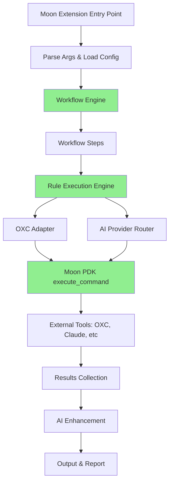
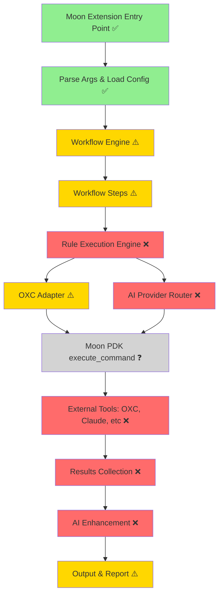

# Moon-Shine: Architecture Gap Analysis Diagram

## Current Implementation vs Expected Architecture

### Expected Architecture Flow



### Actual Implementation Status



**Legend**:
- ✅ Green: Implemented and working
- ⚠️ Yellow: Implemented but not wired/integrated
- ❌ Red: Missing or stubbed
- ❓ Gray: Unverified

---

## Critical Integration Gaps

### Gap 1: Workflow Engine Not Wired

```
┌─────────────────────────────────────────┐
│         extension.rs                     │
│  execute_extension_logic()               │
│                                          │
│  ❌ Missing Connection                   │
│                                          │
└─────────────────────────────────────────┘
                  │
                  │ Should call but doesn't
                  ▼
┌─────────────────────────────────────────┐
│         workflow.rs                      │
│  WorkflowEngine::execute()               │
│  - TypeScript Check                      │
│  - ESLint Lint                           │
│  - AI Enhancement                        │
│  ✅ Fully Implemented                    │
└─────────────────────────────────────────┘
```

### Gap 2: Rule Execution Disconnected

```
┌─────────────────────────────────────────┐
│      rulebase/mod.rs                     │
│  - 582 OXC rules defined                 │
│  - 200+ AI rules planned                 │
│  ✅ Rule Registry Complete               │
└─────────────────────────────────────────┘
                  │
                  │ ❌ No execution path
                  ▼
┌─────────────────────────────────────────┐
│   rulebase/execution_engine.rs           │
│  RuleExecutor                            │
│  - Has oxc_adapter field (unused!)       │
│  ⚠️ Implemented but not wired            │
└─────────────────────────────────────────┘
                  │
                  │ ❌ Never called
                  ▼
┌─────────────────────────────────────────┐
│         workflow.rs                      │
│  Workflow steps                          │
└─────────────────────────────────────────┘
```

### Gap 3: Moon PDK Integration Unverified

```
┌─────────────────────────────────────────┐
│    moon_pdk_interface.rs                 │
│  execute_command()                       │
│                                          │
│  #[host_fn]                              │
│  extern "ExtismHost" {                   │
│    fn host_execute_command(...);         │
│  }                                       │
│  ❓ Unverified                           │
└─────────────────────────────────────────┘
                  │
                  │ ❓ Communication unclear
                  ▼
┌─────────────────────────────────────────┐
│         Moon Host                        │
│  - File system operations                │
│  - Command execution                     │
│  - JSON protocol                         │
│  ❓ Contract unclear                     │
└─────────────────────────────────────────┘
```

### Gap 4: AI Provider Not Integrated

```
┌─────────────────────────────────────────┐
│    provider_router/mod.rs                │
│  - get_provider_api_key() (unused!)      │
│  - Provider selection logic              │
│  ⚠️ Implemented but incomplete           │
└─────────────────────────────────────────┘
                  │
                  │ ❌ No integration
                  ▼
┌─────────────────────────────────────────┐
│         Claude CLI                       │
│  External binary                         │
│  ❌ Not called                           │
└─────────────────────────────────────────┘
```

---

## Component Status Matrix

```
┌────────────────────┬──────────┬───────────┬──────────┐
│ Component          │ Exists   │ Wired     │ Tested   │
├────────────────────┼──────────┼───────────┼──────────┤
│ Extension Entry    │    ✅    │    ✅     │    ⚠️    │
│ Config Management  │    ✅    │    ✅     │    ✅    │
│ Workflow Engine    │    ✅    │    ❌     │    ❌    │
│ Rule Registry      │    ✅    │    ⚠️     │    ⚠️    │
│ Rule Executor      │    ✅    │    ❌     │    ❌    │
│ OXC Adapter        │    ✅    │    ⚠️     │    ⚠️    │
│ AI Provider Router │    ✅    │    ❌     │    ❌    │
│ Moon PDK Interface │    ✅    │    ❓     │    ❌    │
│ AI Behavioral      │    ⚠️    │    ❌     │    ❌    │
│ Error Handling     │    ✅    │    ⚠️     │    ⚠️    │
│ Session Management │    ⚠️    │    ❌     │    ❌    │
│ Storage            │    ✅    │    ⚠️     │    ⚠️    │
└────────────────────┴──────────┴───────────┴──────────┘
```

---

## Module Dependency Issues

### Circular or Missing Dependencies

```
     ┌──────────────┐
     │  extension   │
     └──────┬───────┘
            │
            ▼
     ┌──────────────┐         ┌──────────────┐
     │   config     │◄────────│   workflow   │
     └──────────────┘         └──────┬───────┘
                                     │
                              ❌ Missing
                                     │
                                     ▼
                              ┌──────────────┐
                              │  rulebase/   │
                              │  execution   │
                              └──────┬───────┘
                                     │
                              ❌ Not used
                                     │
                                     ▼
                              ┌──────────────┐
                              │ oxc_adapter  │
                              └──────────────┘
```

---

## Documentation Fragmentation

```
Architecture Documentation Files:

├── ARCHITECTURE_CURRENT.md      (Current state)
│   └── Says: CLI adapter for OXC
│
├── FINAL_ARCHITECTURE.md        (OXC + AI)
│   └── Says: Production ready
│
├── ULTRA_ARCHITECTURE.md        (700+ rules)
│   └── Says: Future vision
│
├── HYBRID_ARCHITECTURE.md       (Technical)
│   └── Says: Hybrid approach
│
└── SOLUTION_SUMMARY.md          (Summary)
    └── Says: Complete

❌ CONFLICT: Multiple sources of truth!
```

---

## Recommended Fix Order

```
Phase 1 (Critical - Week 1):
┌──────────────────────────────────────┐
│ 1. Verify Moon PDK Integration       │
│ 2. Wire Workflow to Extension        │
│ 3. Complete Execution Pipeline       │
│ 4. Fix Test Infrastructure           │
└──────────────────────────────────────┘
                │
                ▼
Phase 2 (High Priority - Week 2-3):
┌──────────────────────────────────────┐
│ 5. Integrate AI Providers            │
│ 6. Wire Rule Execution               │
│ 7. Complete Behavioral Analysis      │
│ 8. Consolidate Documentation         │
└──────────────────────────────────────┘
                │
                ▼
Phase 3 (Medium Priority - Week 4+):
┌──────────────────────────────────────┐
│ 9. Error Handling Audit              │
│ 10. Session Management               │
│ 11. Performance Benchmarks           │
│ 12. Technical Debt Cleanup           │
└──────────────────────────────────────┘
```

---

## Summary Statistics

```
Total Components Analyzed:  15
├── Fully Working:          3  (20%)
├── Partially Working:      7  (47%)
├── Not Working:            4  (27%)
└── Unverified:             1  (7%)

Code Statistics:
├── Source Files:           104
├── Lines of Code:          ~40,000
├── TODOs/FIXMEs:          91
├── Compiler Warnings:      34
└── Build Status:           ✅ Success

Documentation:
├── Total MD Files:         285
├── Architecture Docs:      5+
├── Conflicts Found:        Multiple
└── Needs Consolidation:    Yes
```

---

**See Full Analysis**: 
- [ARCHITECTURAL_ISSUES_ANALYSIS.md](./ARCHITECTURAL_ISSUES_ANALYSIS.md)
- [ARCHITECTURAL_ISSUES_SUMMARY.md](./ARCHITECTURAL_ISSUES_SUMMARY.md)
